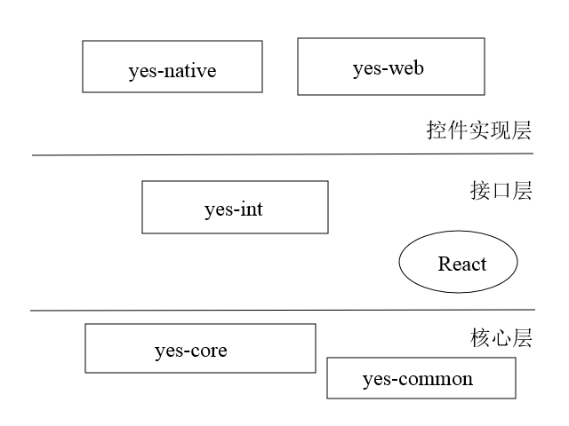

# 思路
  H5归根到底是另外一种形式的Web，同样使用js，尽可能得重用当前Web版本的代码是一种非常合理的想法。如果完全使用web的渲染方案的化，则只需要重新实现一套基于H5的控件实现，理论上就可以完成H5的版本。但在实际操作中发现当前的Web版本代码中控件的渲染和逻辑是很大的黏连性，无法分开，所以在实际开发的过程中，我们还是对Web版本中控件的渲染过程做了比较大的改动，主要的目的是为了达到数据逻辑和界面渲染的完全分离。
1. 核心基于当前Web版本
   前台的脚本解析以及单据对象和控件对象被完整继承下来，当然控件对象相对于Web版本做了很大改动，不再包含任何的界面操作，变成仅仅维护控件内部数据的一个载体。Web版本的一些全局对象也被继承下来，比如FormStack等，这导致了后面一个比较大的问题，就是无法再一个页面或者说一个浏览器实例中渲染两个Yigo项目的单据。
2. 渲染框架基于React
   核心部分提供了单据数据的变化逻辑的前提下，我们将会提供一个独立的基于React的渲染的接口，这个接口定义了不同控件的传入属性，任何人都可以在满足这个接口的前提下，开发自己的控件来用于界面渲染。渲染过程使用react+flux来实现数据驱动。
3. 控件实现
   提供一组对于Yigo基础控件的实现

  

## 核心版本的改造
   对于Web版本核心的改造主要是将Web版本的同步执行机制进行了异步化，剥离了控件的渲染层和数据层。所有的核心层的代码都被包含到了yes-core这个包中。这个包是只依赖一些基本库的和渲染层无关，也就是和React没有关系，将来如果需要做小程序的支持，这个库也是可以使用的。

## 接口层的做法
   使用React的高阶组件的方案来实现，这个层面有一个基本的需求，就是不涉及真正的渲染过程，只提供基于React的控件实现的标准。接口层包含在yes-intf这个库中。这个库仅仅关联react，不予任何渲染库挂钩，只要是基于React的所有渲染库都可以使用这个接口层来实现最终的控件渲染。

## 控件实现
   控件的实现层当前是yes-comp-react-native-web,这个库使用react-native-web作为基础，其中也引入了部分antd-mobile的控件。