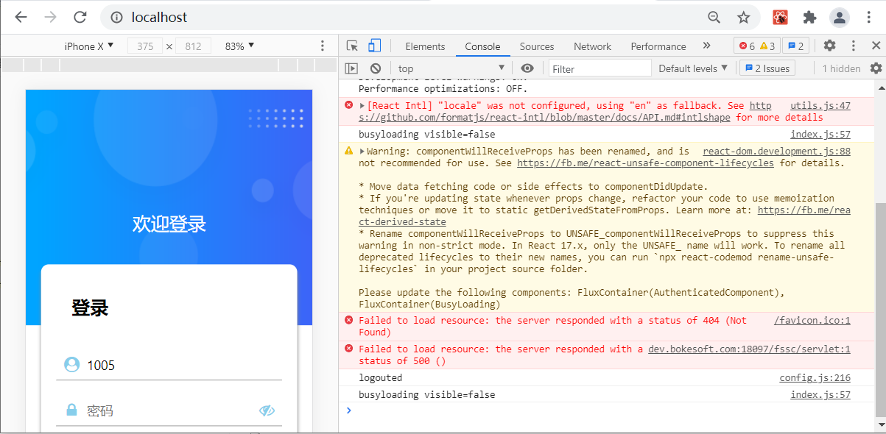
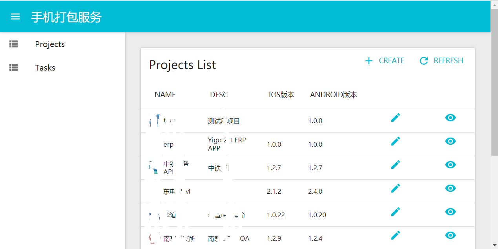
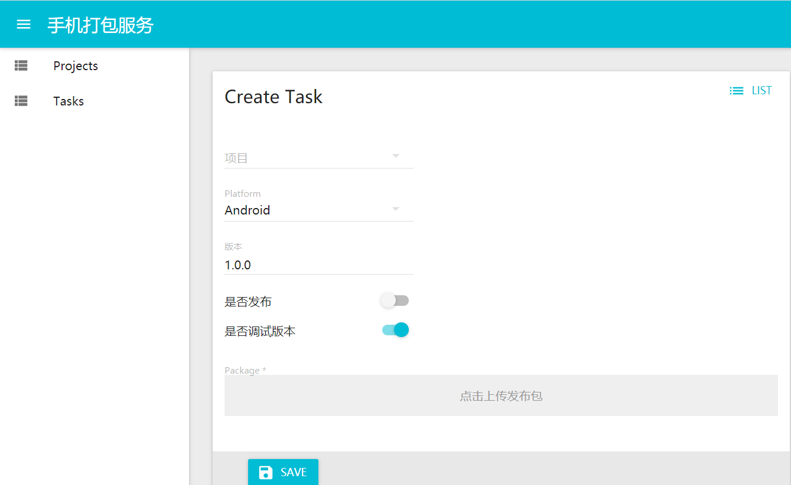

# 开发过程
>    主要目标是完成整个开发过程的介绍，让大家对整个开发过程心里有数，知道在开发App的过程中的主要节点，细节的介绍不在这里完成。
## 初始化开发环境
* 下载框架代码
* 执行npm install安装依赖
* 执行npm start
* 浏览器打开http://localhost
## 连接Yigo服务器
* 配置project.json
## 定制登录页面
>     如果没有做过额外二次开发，则默认的登录页面可以直接完成登录过程，如果
>     需要修改则可以通过开发控件来定制一个登录页面,当然如果使用单点登录方案，则可以不需要登录页面
## 定制首页和路由
### 基本路由属性
* key
* type
* isRoot

  如果为true则当前路由就是初始路由，在登录之后会直接显示
* path
  
  路由的路径，这个路径在跳转的时候使用
### 控件路由
控件路由的type是control
* control

  指向注册的控件

```javascript
    {
        "key": "Home",
        "type": "control",
        "path": "Home",
        "control" : "Home",
        "isRoot": true 
    }
```
### 单据路由
单据路由的type是billform
* formKey
* oid
* status

```javascript
 {
     "type": "billform",
     "formKey": "TSL_ToDoList",
     "oid": -1,
     "key": "TodoList",
     "status": "DEFAULT"
}
```
### Tab路由
Tab路由的type是tab
* tabPosition

  top或者是bottom，定义tab的位置
* tabs

  这个属性是一个路由的数组

```javascript
{
        "key": "TodoList",
        "type": "tab",
        "path": "TodoList",
        "tabPosition": "top",
        "isRoot": false,
        "tabs" : [
            {
                "type": "billform",
                "formKey": "TSL_ToDoList",
                "oid": -1,
                "key": "TodoList",
                "status": "DEFAULT"
            },{
                "type": "billform",
                "formKey": "TSL_RejectWF",
                "oid": -1,
                "key": "RejectWF",
                "status": "DEFAULT"
            },{
                "type": "billform",
                "formKey": "TSL_DoneWorkflow",
                "oid": -1,
                "key": "DoneWorkflow",
                "status": "DEFAULT"
            }
        ]
    },
```
## 配置单据
> 单据的配置过程是一个简单的选择过程，首先需要选择的是一个单据合适的单据模板，然后就是针对不同的需要显示的数据控件，我们需要选择对应的渲染控件，同时给出渲染控件的一些渲染属性。

> 这个配置单据的过程没有多少技术含量，最终是由Yigo单据的配置人员完成
## 定制项目专用的模板和控件
>当配置无法达到界面渲染要求的时候，就需要通过代码定制模板或者控件,一般项目定制模板会在项目初期就确定下来并完成开发，这样后续的单据配置工作可以由单据配置人员完成。 

>这个过程需要高端的开发人员来完成，需要了解手机平台的整体结构，需要Reac的开发基础。同时也需要UI组配置才能完成。
## 编译
>    执行npm run build,编辑结果在根目录的build下,一般调试编译结果为debug.zip,发布版的编译结果为release.zip
## 打包
>    将编译的结果上传到打包服务器生成最终的app

# 开发过程中其他相关问题
### 多语种
> 项目中多语种分两种，一种是从Yigo平台继承来的，一般单据数据控件上的多语种需求都会由Yigo平台来完成，另外一种则是App平台层面提供的多语种方案。
* Yigo多语种
  原则上只要是可以在设计器上能够实现的多语种需求尽量通过这种方式来实现
* App平台多语种
  > App平台多语种根据浏览器的navigator.language字符串来确定的,当前版本的翻译还不支持参数.
  * 多语种对应库
    >项目i18n目录下,这个目录要求导出一个以locale字符串为key的一个对象,
  * 多语种使用
    >在需要支持多语种的控件开发的时候使用internationalWrap对控件进行包装，然后就可以使用,formatMessage属性完成翻译。

```javascript
import React from 'react';
import internationalWrap from 'yes-framework/hoc/internationalWrap';
import { ControlWrap } from 'yes-intf';

const I18nText = ({displayValue, formatMessage})=> {
  return <span>{formatMessage(displayValue)}</span>;
}
export default internationalWrap(ControlWrap(I18nText));
```
### 图标
> 项目中使用IconFont解决方案,在处理图标库的过程中可能需要Python的运行环境，操作步骤如下
1. 在IconFont中创建项目，并加入项目中相关的图标
2. 从IconFont中下载本项目的字体库
3. 将字体库中的ttf文件复制到项目的font目录下
4. 运行font目录下的createicon.bat

#### 图标使用
> 在控件开发中可以直接应用yes-framework/font来引入项目自定义图标
```javascript
import React from 'react';
import IconFont from 'yes-framework/font';
import { ControlWrap } from 'yes-intf';

export default IconText=ControlWrap(({value, style})=> {
  return <IconFont name={value} style={style} />
});
```
### 调试
> 项目开发过程中的调试方式使用的是chrome浏览器的React Developer Tools来完成调试工作。
1. 运行npm start之后会启动本地开发服务器
2. 打开Chrome访问http://localhost地址，打开页面
3. 在Chrome当前页面中点击F12启动Chrome调试器
4. 与一般的浏览器页面一样进行调试

  
  
### 编译
> 编译过程分两种，调试模式和发布模式，编译的结果默认是放在/build目录下，并且已经存在一个zip的压缩文件。
* 调试模式
  命令为npm run build:debug,这种模式产生的结果会很大
* 发布模式
  命令为npm run build:release

### 发布
> 最终打包成手机可以直接运行的App的过程，通过访问打包网站
  

1. 在打包网站上创建一个项目
2. 填写项目的基本信息
    >其中最主要的是需要一共一个正方形的图标
3. Android不需要额外配置，默认使用打包环境提供的keystore
4. Ios需要自己申请证书，完成必要的证书和ProvisionFile上传
5. 新建一个任务，选择任务的一些属性，上传编译之后生成的zip文件
  
